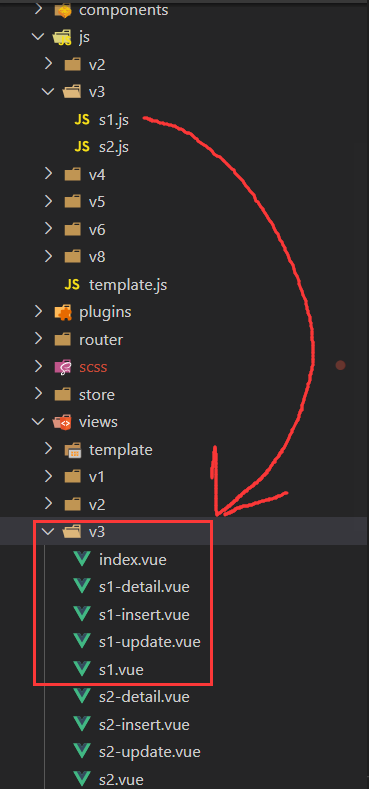
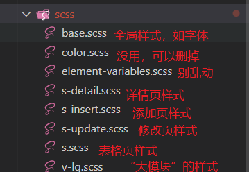
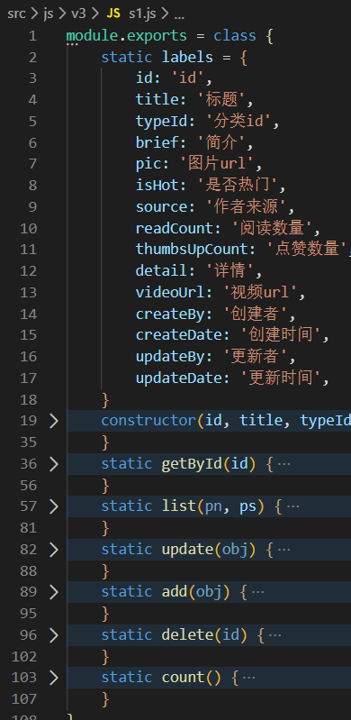
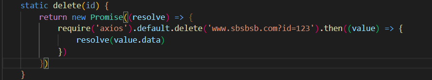
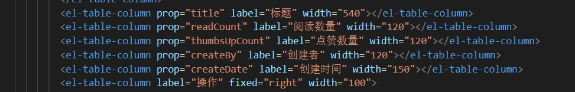
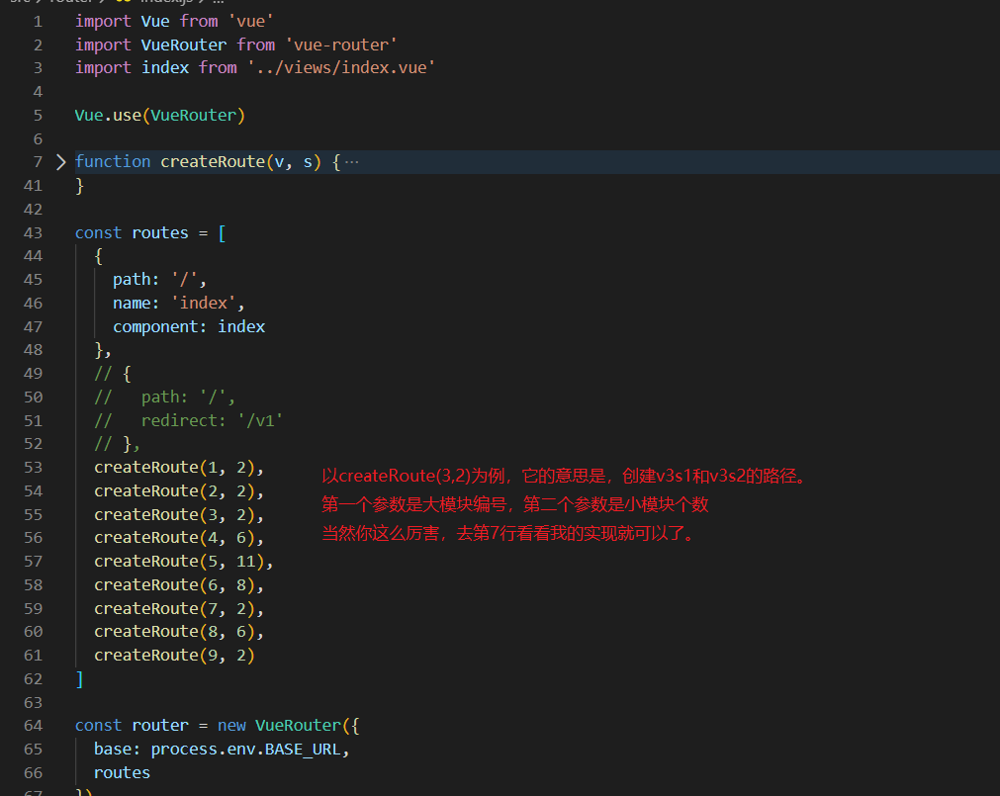

~# 对虾全产业链云平台后台管理系统

## 开篇废话

不知屏幕前的你看到这又臭又长的项目时心里作何感想，总之，不喜轻喷谢谢。

哦还有，如果你看这个项目真的很不爽的话，果断地重写一个吧！

## 一些非常基础的概念

私以为这个文档写得已经非常RZ了，但即便如此您也应该知道这些：

##### 安装Node.js

百度搜索“node.js安装”

##### 安装vue-cli

```shell
npm install -g @vue/cli
```

别信网上什么npm i -g vue-cli，这个是老版本

##### 追加安装element和axios

##### 把文件和文件夹塞进去

替换掉所有文件

##### 启动dev服务

打开您电脑的控制台，在根目录下运行:

```shell
npm run serve
```

等待项目编译，完了之后弹出一个地址，访问之，即可看到效果。

##### 有人叫我部署

打开您电脑的控制台，在根目录下运行:

```shell
npm run build
```

等待项目编译，完了之后把：根目录下dist文件夹、根目录下package.json、根目录下server.js拷走。

在服务器上安装node、安装依赖（是的就是上面的第一第二步），然后打开控制台，在根目录下运行：

```shell
node server.js
```

就可以了！

##### 还可以云部署

## 简单了解这个项目

看看这些文件夹都装了什么东西

##### docs

里边有需求文档，对于看不明白的我来说很是蛋疼。

##### public

别的不说，这个error.html，就是404时返回的页面。

##### src

###### assets

放图片

###### components

放组件

###### plugins

不懂别乱动，里边那个文件引入了elementUI

###### store和router

放vuex和vue-router，还是不懂别乱动

## 最重要的四个文件夹

**src/js、src/scss、src/views、src/router**

**src/js、src/scss、src/views、src/router**

**src/js、src/scss、src/views、src/router**

重要的话说三遍！



##### “大模块”和“小模块”

v3代表“大模块”3，这里对应远程教育。

s1代表“小模块”1，这里对应远程教育-课程信息。

“大模块”的命名必须按顺序，现在是v9，那么下一个就必须是v10。

每个”小模块“在views里都含有s1、detail、insert、update四个文件，在js里都含有s1这个文件。分别对应表格界面、详情界面、添加界面、修改界面、表格的**所有交互**。

##### 那SCSS是什么

直接上图



你可能会问，为什么要这么搞？vue里边有style你丫不知道么？

呵呵，几十个页面的样式一毛一样，你要是不分离出来，一处改处处改。

##### 你在说什么，我听不懂

没关系，下面这个版块才是重中之重。

## “傻瓜式”做项目

以前只有我和上帝知道这些代码是如何运作的，但此刻只有上帝知道了。所以它的实现细节重要吗？

### 我怎么接手这个项目？

下面以v3-s1（远程教育-课程信息）为例，告诉你如何做完一个”小模块“

1. 检查表格字段

   

   labels是键值对，value是表格的字段（给人看的），key是数据库字段（给你看的）~~没有骂你的意思~~。

   要改的话，constructor这个构造函数也要改。

2. 看到上图那6个被static修饰的方法了吗？那就是你要做的！

   他们分别对应：根据ID获取详情、获取所有记录（pn=page number，是页码；ps=page size，是每页数量）、更新某条记录、增加某条记录、删除某条记录、获取数据库总记录数。

   整个项目的回调风格是Promise，所以你的代码大概得这么写：

   

   别告诉我你真的要把require放在函数里！放到外面去啊！

> 你可能会问：axios不是有个then吗，直接return不就好了，为什么还要套一个Promise？
>
> 因为axios的then里边只有data才是我们需要的，如果直接return了，vue里边调用这些model层的方法时都要加一个.data，这可不妙啊

完啦！你要做的就是把这些现有的v1s1-v9s?都写好。

#### 警告

你可能看到getById和list函数里有了具体实现，并且心里暗自窃喜”这个不用我写啦“！

但很遗憾，你看到的是模拟数据生成器。

把它们删掉！用你所学的知识写好它！

------------------------------------------------------------------------

如果你还是觉得无从下手，试试看看下面这个版块

### 我想新增一个小模块

##### model方面，复制一份s?.js

然后，修改这份文件的以下部分

1. **labels和构造函数**
2. 各方法的具体实现

##### views方面，复制一份s?.vue
s-detail中，改动L17和L28
s-update中，改动L24、L36和L40
s-insert中，改动L24、L34和L39
s中：

1. L4的标题

2. script部分的，require，毕竟路径要对的上

3. script部分的，handleAdd、handleDetail、handleUpdate中的路径

4. L35左右的table-column，你想展示多少个字段数据都可以，但要注意宽度之和要等于1050（id和操作的宽度不算），否则小屏幕的显示很不友好

   

   看到了吗，width的和总是1050

##### router

调用createRoute即可。



> 你可能会问为什么用这么反人类的写法。因为我发现如果一个一个敲的话，既很累又没必要。

## 最后发言

还是那句话，如果接手这个项目让你非常吃不消的话，果断放弃它。自己从头开始写一个可能更快。你现在看到的所有代码，不过花了我7*8=56小时。所以权衡一下怎么做才更快是很重要的。

保重了！英勇无畏的继承人！

保重了！英勇无畏的继承人！

保重了！英勇无畏的继承人！

## 彩蛋

src/scss里有一个color.scss，那个确实没有用在项目中，可以删掉。

但你要是侮辱这些颜色的话，我会代表二次元诅咒你。